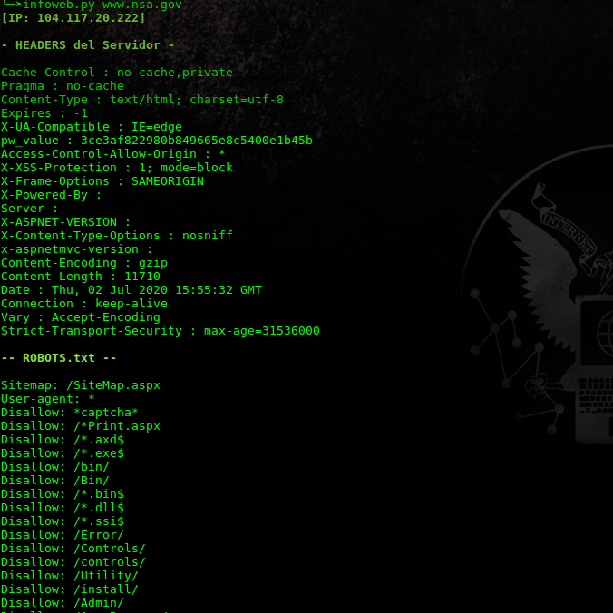
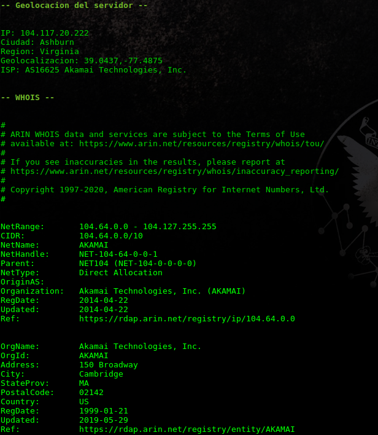

# infoweb
Recolectando información de un servidor Web de forma pasiva y activa.

## Informacion obtenida
- Cabezeras del servidor (Headers)
- Fichero robots.txt
- Geolocalizacion del servidor
- Whois

## Uso
Este proyecto solo usa modules estandar, con excepcion de **requests**
que no esta instalado en todos los sistemas, tu puedes instalar usando...``pip install requests``

```bash
chmod +x infoweb.py
./infoweb.py <target>
```
## Preview


